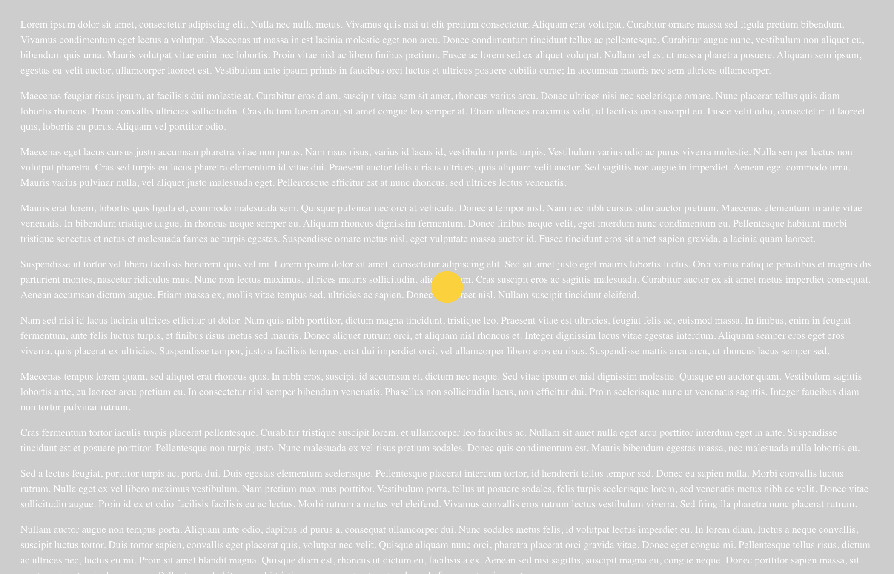
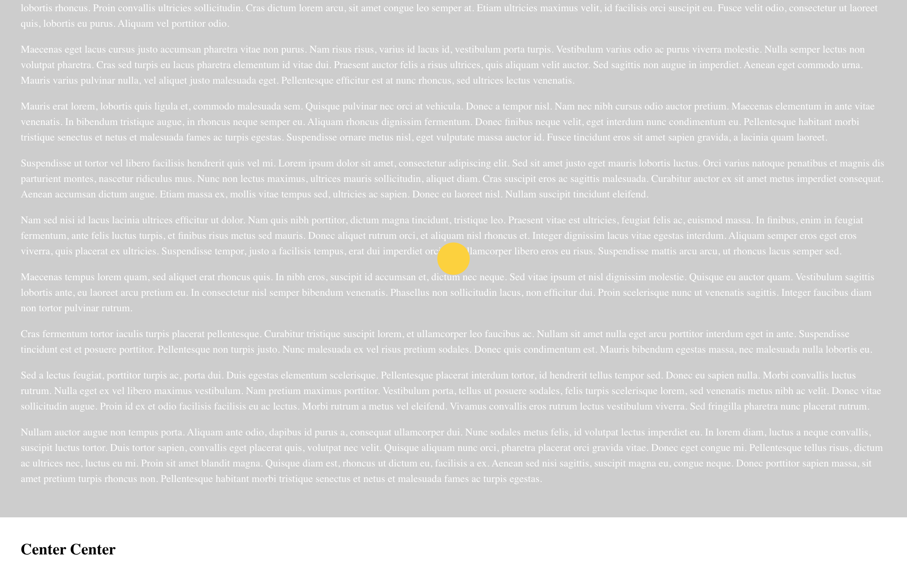

# center-center

For calculating the `left` and `top` position coordinates of a vertically and horizontalled centered _target_ element within a _container_ according to _the container_'s position in the viewport

The target is at the _center center_ of its container here:

And here:

And here:

The position of the vertically and horizontalled centered target element _changes_ according to how its container is located in the viewport

A demonstration can be found in [docs](docs/index.html)
